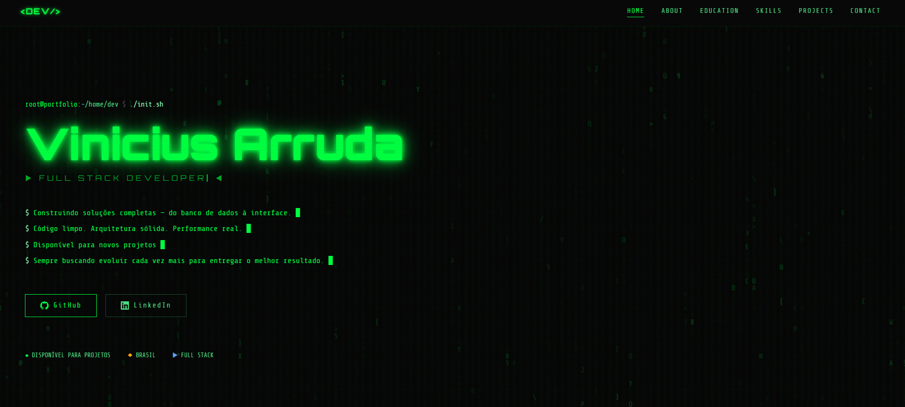

# 🟢 Portfólio — Dev Full Stack
 
Portfólio pessoal desenvolvido com **React**, **TypeScript** e **Tailwind CSS**, com identidade visual no tema **hacker terminal** — fundo escuro, verde neon, efeito Matrix e animações estilo terminal.
 
---
 
## 🚀 Tecnologias
 
- **React 18** — biblioteca de interface
- **TypeScript** — tipagem estática
- **Tailwind CSS v3** — estilização utilitária
- **Vite** — bundler e servidor de desenvolvimento
- **Simple Icons** (CDN) — ícones das tecnologias na seção de habilidades
- **Google Fonts** — fontes Orbitron e Share Tech Mono
 
---

## 🖼️ Demonstração do Portfólio
   

 
## 📁 Estrutura do Projeto
 
```
portfolio/
├── public/
├── src/
│   ├── components/
│   │   ├── Navbar.tsx         # Navegação fixa com menu hamburger mobile
│   │   ├── Hero.tsx           # Seção inicial com efeito Matrix e typing animation
│   │   ├── MatrixCanvas.tsx   # Canvas com animação de caracteres estilo Matrix
│   │   ├── About.tsx          # Bio e tabela de informações pessoais
│   │   ├── Formation.tsx      # Formação acadêmica
│   │   ├── Skills.tsx         # Grid de ícones de tecnologias por categoria
│   │   ├── Projects.tsx       # Cards de projetos com imagem e links
│   │   ├── Contact.tsx        # Links de contato e e-mail
│   │   ├── Footer.tsx         # Rodapé
│   │   └── SectionLabel.tsx   # Componente reutilizável de título de seção
│   ├── data/
│   │   └── index.ts           # Todos os dados do portfólio (edite aqui!)
│   ├── App.tsx
│   ├── main.tsx
│   └── index.css              # Animações e classes customizadas do Tailwind
├── index.html
├── tailwind.config.ts
├── tsconfig.json
├── vite.config.ts
└── package.json
```
 
---
 
## ⚙️ Como rodar localmente
 
### Pré-requisitos
- Node.js 18+
- npm ou yarn
 
### Instalação
 
```bash
# Clone o repositório
git clone https://github.com/seuuser/portfolio.git
 
# Entre na pasta
cd portfolio
 
# Instale as dependências
npm install
 
# Inicie o servidor de desenvolvimento
npm run dev
```
 
O projeto estará disponível em `http://localhost:5173`
 
### Build para produção
 
```bash
npm run build
```
 
---
 
## ✏️ Como personalizar
 
Todos os dados do portfólio estão centralizados em **`src/data/index.ts`**. Edite esse arquivo para atualizar o conteúdo sem precisar mexer nos componentes.
 
### Projetos
 
```ts
export const PROJECTS: Project[] = [
  {
    id: '01',
    name: 'Nome do Projeto',
    desc: 'Descrição do projeto...',
    tech: ['React', 'Node.js', 'PostgreSQL'],
    status: 'PRODUCTION',        // PRODUCTION | OPEN SOURCE | EM DEV
    statusColor: '#00FF41',      // cor do badge
    github: 'https://github.com/seuuser/projeto',
    demo: 'https://seuprojeto.com',  // opcional
    preview: 'https://url-da-screenshot.png', // imagem do card
    url: 'seuprojeto.com',
  },
]
```
 
### Habilidades
 
Adicione ou remova tecnologias usando os slugs do [Simple Icons](https://simpleicons.org):
 
```ts
{ name: 'React', icon: 'react' },
{ name: 'Next.js', icon: 'nextdotjs' },
```
 
### Contato
 
```ts
export const CONTACT_LINKS: ContactLink[] = [
  { label: 'GITHUB',   value: 'github.com/seuuser',      href: 'https://github.com/seuuser' },
  { label: 'LINKEDIN', value: 'linkedin.com/in/seuuser', href: 'https://linkedin.com/in/seuuser' },
]
```
 
### Dados pessoais
 
Edite `ABOUT_ROWS` em `src/data/index.ts` para atualizar nome, localização, especialidade etc.
 
### Hero
 
Em `src/components/Hero.tsx`, troque:
- `SEU NOME` pelo seu nome real
- Os textos das linhas de digitação
- As URLs do GitHub e LinkedIn nos botões CTA
 
---
 
## 🎨 Identidade Visual
 
| Elemento | Valor |
|---|---|
| Cor principal | `#00FF41` (verde neon) |
| Cor secundária | `#4ade80` (verde médio) |
| Texto de corpo | `#bbf7d0` (verde claro) |
| Fundo | `#080808` (preto quase puro) |
| Fundo de cards | `#0a0a0a` |
| Fonte display | Orbitron (títulos e logo) |
| Fonte mono | Share Tech Mono (todo o resto) |
 
---
 
## 📱 Responsividade
 
- **Mobile** — menu hamburger com overlay fullscreen animado
- **Tablet** — layout adaptado em 2 colunas onde aplicável
- **Desktop** — navegação horizontal, projetos em lista alternada
 
---
 
## 🗂️ Seções
 
| Seção | Descrição |
|---|---|
| **Home** | Hero com efeito Matrix, typing animation e botões de CTA |
| **About** | Bio pessoal e tabela de informações |
| **Formatiom** | Formação acadêmica |
| **Skills** | Ícones das tecnologias agrupados por categoria |
| **Projects** | Cards com imagem, descrição, stack e links |
| **Contact** | E-mail e links para redes sociais |
 
---
 
## 📦 Deploy
 
### Vercel (recomendado)
 
1. Suba o projeto para o GitHub
2. Acesse [vercel.com]() e importe o repositório
3. A Vercel detecta o Vite automaticamente — clique em **Deploy**
4. Pronto! URL gerada automaticamente

   Deploy do portfolio: https://my-portfolio-react-steel.vercel.app/

 
### Netlify
 
```bash
npm run build
# Arraste a pasta /dist para netlify.com/drop
```
 
---
 
## 📄 Licença
 
Este projeto é de uso pessoal. Sinta-se livre para usar como referência e adaptá-lo ao seu próprio portfólio.
 
---
 
Desenvolvido por **Vinicius Arrruda** — [https://github.com/ViniciusSavianDeArruda]()


